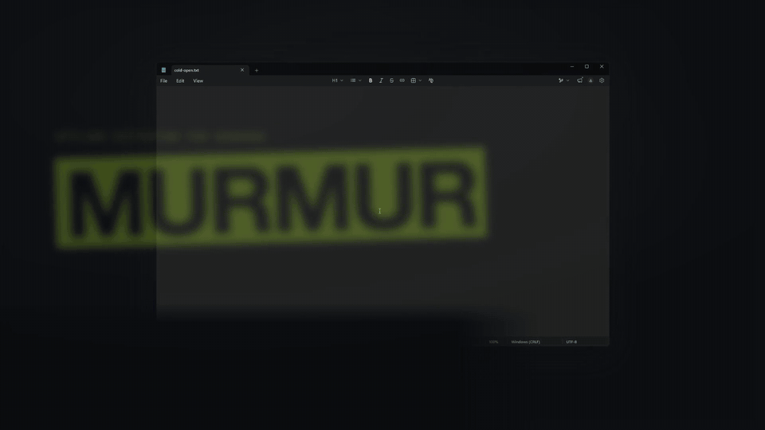

# Murmur

Offline push-to-talk dictation for Windows and macOS (preview). Hold a key, speak, let go — the text is typed wherever your cursor is. Speech recognition runs entirely on your machine; nothing you say leaves it.



## Features

- **Push-to-talk** — hold Right Ctrl (Right Option on a Mac; configurable), speak, release. Works in any app that accepts typing.
- **Hands-free** — double-tap the key to keep recording without holding it. Tap again to finish, Esc to cancel. Stops on its own after 5 minutes.
- **Spoken commands** — say "new line" or "new paragraph".
- **Filler removal** — drops "um", "uh", "er" and friends.
- **Custom dictionary** — teach it names and jargon, with phonetic matching for near-misses.
- **Fix last** — hold Shift with the key to edit the last dictation; Murmur learns your corrections into the dictionary.
- **Snippets** — say a trigger phrase and a saved block of text is pasted instead.
- **History** — the last 25 dictations, from the tray or menu bar.
- **Quiet while you talk** — mutes your speakers while the key is held.
- **Fast, local model** — NVIDIA Parakeet TDT 0.6B v2 (int8) via [sherpa-onnx](https://github.com/k2-fsa/sherpa-onnx), CPU only.

## Install

### Windows

Requires Windows 10 or 11 (x64). No GPU needed.

1. Download `murmur-vX.Y.Z-setup.exe` from [Releases](../../releases) and run it. It installs for your user only (no admin prompt), adds Murmur to the Start menu and, if you leave the box ticked, starts it with Windows. Prefer no installer? Download `murmur-vX.Y.Z-windows-x64.zip` instead and unzip it anywhere, keeping the DLLs next to `murmur.exe`.
2. Murmur isn't code-signed yet, so Windows SmartScreen may say "Windows protected your PC". Click **More info → Run anyway**.
3. On first launch Murmur downloads the speech model (about 460 MB, one time) to `%LOCALAPPDATA%\Murmur\models`, then shows a short "you're ready" screen.

To start Murmur with Windows, tick **Start with Windows** in the tray menu.

### macOS (preview)

Requires macOS 13 or later on Apple Silicon (M1 or newer). The Mac build is a preview: it isn't signed by Apple yet, which adds a step on first launch and after every update (below).

1. Download `murmur-vX.Y.Z-macos-arm64.dmg` from [Releases](../../releases), open it and drag **Murmur** onto **Applications**.
2. Open Murmur. macOS says it can't verify it: open **System Settings → Privacy & Security**, scroll down, click **Open Anyway** next to Murmur and confirm. This is needed once per version.
3. Murmur asks to be allowed under **Accessibility**, which it needs to paste. Its setup card takes you to the right place in System Settings and moves on once you've allowed it. macOS asks for the microphone the first time you dictate.
4. Murmur downloads the speech model (about 460 MB, one time) to `~/Library/Application Support/Murmur/models`, then shows a short "you're ready" screen.

Murmur lives in the menu bar, with a small pill above the Dock. To start it when you log in, tick **Open at Login** in its menu.

### Uninstall

**Windows:** Settings → Apps → Murmur → Uninstall. It asks whether to also delete the speech model and your settings, dictionary and snippets; both default to keeping them. If you used the zip, quit Murmur, untick **Start with Windows** first, then delete the folder.

**macOS:** untick **Open at Login**, quit Murmur, and drag it from Applications to the Trash. Your settings and the model are in `~/Library/Application Support/Murmur`; delete that folder to remove them too. Remove Murmur from **System Settings → Privacy & Security → Accessibility** as well.

## Updating

Murmur doesn't update itself. To get notified of new versions, click **Watch → Custom → Releases** on this repository.

**Windows:**

1. Download the new `murmur-vX.Y.Z-setup.exe` from [Releases](../../releases) and run it. It closes Murmur, updates it in place and keeps your start-with-Windows choice.
2. Zip users: quit Murmur (tray icon → Quit), unzip the new zip over the old folder, replacing the files, and start `murmur.exe`.

**macOS:** quit Murmur, open the new DMG and drag Murmur onto Applications, replacing the old one, then open it (and click **Open Anyway** again, as on first install). Because the preview isn't signed by Apple, macOS treats each version as a new app: in **System Settings → Privacy & Security → Accessibility**, select Murmur, remove it with **−**, then allow it again when Murmur asks. Switching it off and on isn't enough.

Your settings, dictionary, snippets and the model are kept (`%APPDATA%\Murmur` and `%LOCALAPPDATA%\Murmur\models` on Windows, `~/Library/Application Support/Murmur` on a Mac), so nothing is downloaded again.

## Usage

The default key is **Right Ctrl** on Windows and **Right Option** on a Mac.

- **Dictate:** hold the key, speak, release. The text appears at the cursor.
- **Hands-free:** double-tap the key. Tap once more to paste, or press Esc to discard.
- **Fix the last dictation:** hold **Shift** and press the key.

Murmur lives in the system tray on Windows (teal microphone; grey when paused) and in the menu bar on a Mac. Right-click the tray icon, click the menu bar icon, or right-click the pill for:

| Menu item | What it does |
|---|---|
| Pause / Resume | Stop listening for the hotkey |
| Fix last dictation (Shift + push-to-talk key) | Edit the last dictation |
| History… | Browse recent dictations |
| Dictionary… | Add, edit, delete and test dictionary terms |
| Snippets… | Add, edit, delete and test snippets |
| Push-to-talk key: (your key)… | Pick another key or chord by pressing it |
| Open config folder | Open the folder with your settings, dictionary and snippets |
| Start with Windows / Open at Login | Start Murmur when you sign in (on/off) |
| About Murmur | Version, update check, what Murmur has learned, and licences |
| Quit | Exit Murmur |

## Configuration

Settings live in `config.toml` in the config folder (`%APPDATA%\Murmur` on Windows, `~/Library/Application Support/Murmur` on a Mac), created with defaults on first run. Restart Murmur after editing it.

| Key | Default | Meaning |
|---|---|---|
| `ptt_key` | `"RControl"` (Windows), `"RAlt"` (Mac) | Push-to-talk key: `RControl`, `LControl`, `RAlt`, `LAlt`, `RShift`, `CapsLock`, `ScrollLock`, `Pause`, or `F1`–`F24`. On a Mac, Alt is Option, and `ROption`, `LOption`, `RCommand` and `LCommand` work too. Easier: **Push-to-talk key** in the menu |
| `model_dir` | `%LOCALAPPDATA%\Murmur\models\…` (Windows), `%HOME%/Library/Application Support/Murmur/models/…` (Mac) | Speech model folder. Only the default location is downloaded automatically |
| `threads` | `8` | CPU threads for recognition |
| `min_silence_ms` | `500` | Silence that ends a speech segment |
| `fillers` | `["um", "uh", "er", "hmm", "mm"]` | Words removed from the output |
| `spoken_commands` | `true` | Turn "new line" / "new paragraph" into line breaks |
| `format_by_context` | `true` | Shape the text for the app it lands in. Today that means email: a greeting and a sign-off get their own lines. `false` = the same output everywhere |
| `email_apps` | Outlook and Thunderbird on Windows; Mail, Outlook and Thunderbird on a Mac | Programs treated as email: exe names on Windows, bundle ids on a Mac (`com.apple.mail`). One list serves both; each system ignores the other's |
| `email_titles` | `["Gmail", "Outlook", "Proton Mail", "Yahoo Mail"]` | Window-title text treated as email, in browsers only |
| `mic_always_on` | `true` | Keep the mic open between dictations so the first word isn't clipped; closes after `idle_unload_minutes` |
| `mute_output` | `true` | Mute the speakers while the key is held |
| `hands_free_max_minutes` | `5` | Hands-free recordings stop and paste after this long |
| `idle_unload_minutes` | `15` | Idle minutes before the model is unloaded and the mic closes, to free memory. `0` = never |
| `debug_log` | `false` | Also log dictated text. Leave off for privacy |

### Email formatting

When you dictate into an email app, Murmur puts a greeting and a sign-off on their own lines. Say "hi Sarah thanks for the update I'll send notes by Friday thanks Jeff" and you get:

```
Hi Sarah,

Thanks for the update. I'll send notes by Friday.

Thanks,
Jeff
```

Everywhere else the same words are pasted as one paragraph. Only the very start and the very end of a dictation are looked at, so an email dictated in several goes works.

Murmur recognises Outlook and Thunderbird (and Mail on a Mac) by program, and Gmail, Outlook, Proton Mail and Yahoo Mail in Chrome, Edge, Firefox, Brave, Opera, Vivaldi, Arc and Safari by the tab title. Add your own with `email_apps` and `email_titles`, or turn the feature off with `format_by_context = false`.

Limits: the greeting and sign-off are recognised from the punctuation the speech model writes, so a greeting it leaves unpunctuated ("Hi Sarah can you…") is pasted as usual. Any field in a webmail tab is treated as email, including its search box, as is any browser tab whose title contains one of the `email_titles`. "Thanks, Sarah." at the end is laid out as a sign-off even when you were thanking Sarah.

### Dictionary

The dictionary maps what you say to what should be written. Open it from the tray with **Dictionary…**: pick a term to edit it, **+ New term** to add one, and type or dictate into the test box to see what the dictionary does to a phrase. Changes apply to the next dictation once you save; dictation keeps working while the editor is open. Fix-last adds entries automatically.

- **Written as:** the text Murmur writes.
- **Heard as:** what the speech model tends to hear instead, e.g. `cooper netties` for Kubernetes.
- **Also match sound-alikes:** also catch words that sound like the term. On by default.

The terms live in `dictionary.toml` in the config folder (the editor's **Open dictionary file** link opens it). You can edit the file by hand; saving from the editor removes comments from it.

```toml
[[term]]
written = "Kubernetes"
spoken = ["cooper netties"]
phonetic = true   # also match words that sound alike (default)
```

### Snippets

Say a trigger phrase anywhere in a dictation and a saved block of text is pasted instead, exactly as written. Open them from the tray with **Snippets…**: pick one to edit it, **+ New snippet** to add one (**Say** is the trigger, **Paste** is the text), and type or dictate into the test box to see what the snippets do to a phrase. Triggers match whole words, ignoring case and punctuation. Changes apply to the next dictation once you save; dictation keeps working while the window is open.

Snippets live in `snippets.toml` in the config folder, which you can also edit by hand:

```toml
[[snippet]]
trigger = "my signature"
text = """
Best,
Your Name"""
```

## Privacy

- Audio is processed in memory and never saved or sent anywhere.
- The only network access is the one-time model download from the [sherpa-onnx releases](https://github.com/k2-fsa/sherpa-onnx/releases/tag/asr-models).
- `murmur.log` in the config folder records events, not what you said, unless you turn on `debug_log`.
- To recognise an email app, Murmur reads the name and window title of the program you are dictating into. They are used for that one check and never stored or logged.

## Build from source

### Windows

Requires the Rust stable toolchain with the MSVC target (`x86_64-pc-windows-msvc`) and the Visual Studio C++ build tools.

```bash
cargo build --release
```

The sherpa-onnx prebuilt libraries are downloaded during the build. `target/release/` then holds `murmur.exe` plus the four DLLs it needs. The C runtime is linked statically (see `.cargo/config.toml`), so no Visual C++ redistributable is required.

To build the installer, install [Inno Setup 6](https://jrsoftware.org/isinfo.php) (`winget install JRSoftware.InnoSetup`) and run, from the repo root after `cargo build --release`:

```bash
ISCC.exe /DAppVersion=X.Y.Z installer\murmur.iss
```

### macOS

Requires the Rust stable toolchain and the Xcode Command Line Tools (`xcode-select --install`), on Apple Silicon.

```bash
./scripts/macos/bundle.sh
```

This builds `target/release/Murmur.app`, with the sherpa-onnx dylibs inside it. macOS ties Murmur's Accessibility and microphone permissions to its signature, so with no signing identity every rebuild counts as a new app. To keep the permissions across rebuilds, make a self-signed code-signing certificate named "Murmur Dev" in Keychain Access (**Certificate Assistant → Create a Certificate**, type Code Signing); `bundle.sh` uses it, or set `MURMUR_SIGN_IDENTITY`. `./scripts/macos/dmg.sh` then packs the app into a DMG.

### Tests

```bash
cargo test --release
```

On Windows, if the ONNX tests crash, copy `target/release/*.dll` into `target/release/deps/` (Windows otherwise loads an older `onnxruntime.dll` from System32). The speech integration test is skipped unless the model is installed.

## Credits and licences

Murmur is released under the [MIT License](LICENSE).

It builds on:

- **[Parakeet TDT 0.6B v2](https://huggingface.co/nvidia/parakeet-tdt-0.6b-v2)** by NVIDIA, licensed under [CC-BY-4.0](https://creativecommons.org/licenses/by/4.0/). Murmur uses the int8 ONNX conversion published by the sherpa-onnx project. The model is downloaded on first run and is not distributed with Murmur.
- **[sherpa-onnx](https://github.com/k2-fsa/sherpa-onnx)** by k2-fsa (Apache-2.0), which bundles [ONNX Runtime](https://github.com/microsoft/onnxruntime) (MIT).
- **[Silero VAD](https://github.com/snakers4/silero-vad)** (MIT), for voice activity detection.
